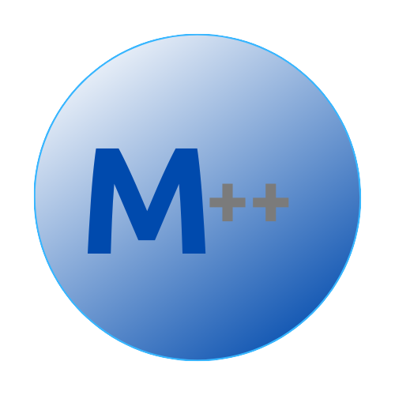

# The M++ Programming Language
---------------------------
## Documentation

### Installation
#### MacOS and Linux Operating Systems
Clone GitHub Repository:
```
git clone https://github.com/mac-lawson/m.git
```
```
cd m
```
Install Python Dependencies:
```
python3 -m pip install matplotlib
```
Make the m++ interpreter script and the project manager script executables:
```
chmod +x m++
chmod +x projmon
```
#### Creating and running a new project
To create a new m++ project, you can use the ProjectManager (projmon) which is included with the installation:
```
./projmon project_name 
```
